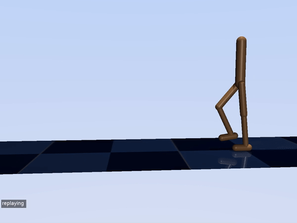

# Trajectory Optimisation With Key-points (TrajOptKP)
This package showcases an efficient method to perform gradient-based trajectory optimisation by reducing 
the number of expensive finite-differencing computations required to perform optimisation. The basic
methodology is computing [Key-points](#Key-points) over a trajectory where expensive finite-differencing computations
are performed, the remainder of the dynamics derivatives needed for trajectory optimisation are then
approximated via linear interpolation.

This package includes a set of example tasks that can be solved via trajectory optimisation, including 
non-prehensile manipulation and locomotion. This package is implemented in C++, and uses MuJoCo as the
physics simulator.

Please note that this code is still under active development.

## Dependencies
- [MuJoCo 2.32](http://www.mujoco.org/)
- [Eigen 3](https://eigen.tuxfamily.org/dox/GettingStarted.html)
- [YAML](https://github.com/jbeder/yaml-cpp)
- [GLFW](https://www.glfw.org/)

## Installation

1. Clone this repository (Please note that this repository uses submodules, 
so you need to clone recursively.
   ```
   git clone --recursive https://github.com/DMackRus/TrajOptKP.git
   ```  
2. Set the following environment variables.
   ```
   export MJ_HOME=*path to the home directory of MuJoCo*
   ```
3. Build the package.
   ```
   cd TrajOptKP
   mkdir build
   cd build
   cmake -DCMAKE_BUILD_TYPE=Release ..
   make
   ```

## Usage
### Setup
There are two config yaml files that the user can change to run different examples. The first config 
is called **generalConfig.yaml**. This file determines various high level settings (such as optimiser, task, etc.)
which are explained in the configuration file.

The second config file is specific to the task being loaded, all task config files are located in **taskConfigs** folder. 
There are some high level settings, as follows:
- **modelFile**: Relative path to the model xml file
- **modelName**: Name of the model, used for saving data
- **timeStep**: Time step for simulation
- **keypointMethod**: Key-point method to use in optimisation. See below for more details.
- **minN**: Minimum interval between key-points
- **maxN**: Maximum interval between key-points
- **iterativeErrorThreshold**: Error threshold for iterative error method

As well as these high level settings, there is the task description. Every task is specified by a collection of **robots** amd **bodies**.
**Robots** are actuated whereas **bodies** are not. This list of robots and bodies instantiates the trajectory 
optimisation problem, by defining starting and desired states, as well as cost attributes. Finally, there are also settings
for each DoF that relate to key-point methods, Please see the [Key-points](#Key-points) section for additional details.

### Run the code
To run the code, there is a bash script that handles building and running provided. Simply run the
following command:
```
bash run.bash
```

## Examples
Here are some example trajectories that have been generated using this package.

**Manipulation**

Here are 4 example of contact-based manipulation in this repository. The examples are: Sweeping
a large heavy box to a target location, and three examples of pushing a small light cylinder to 
a goal location through varying levels of clutter.

<p align="middle">
   
   
   
   
</p>

**Locomotion**

A locomotion example of the 9 DoF walker model. Goal is to keep moving forward whilst keeping the 
body upright at a specific height.

<p align="middle">

</p>

**Dynamic motion**
Coming soon.

## Key-points
Computation of dynamics gradients via finite-differencing is computationally expensive and 
is generally the bottleneck of gradient-based trajectory optimisation. We propose only 
performing these finite-differencing computations at "key-points" over the trajectory, and
approximating the remainder of the dynamics gradients via linear interpolation. If these
key-points are chosen intelligently, we can compute an approximated set of derivatives significantly
faster without noticeable degradation on the performance of the final optimal trajectory.


There are four key-point methods implemented in this repository.

### Set-interval
The Set-interval method has one parameter (minN)

The Set-interval method is the simplest.The key-points are equally spaces with an interval of minN inbetween them.

### Adaptive-jerk
The Adpative-jerk method has three parameters (minN, maxN, jerk_threshold)

The Adaptive-jerk method calcualtes the jerk over the trajectory for all the dofs in the state vector. Whenever the jerk threshold is exceeded, the time-step is marked as a "key-point".  New key-points cant be placed within minN steps of another. If the jerk_threshold isnt exceeded within maxN time-steps, another key-point is placed automatically.

### Iterative error
The Iterative-error method has two parameters (minN, error_threshold)

The iterative error method works very similarly to adaptive-size cell decomposition (A common path-planning algorithm). It starts out with a bad approximation and iteratively improves it until all segments are below a certain error threshold.

It starts with a bad linear approximation (just using the fist and last time-steps). It then checks the middle of the interpolation, by comparing the difference between the true derivatives (computed via autodiff) and the approximated derivatives (computed via linear interpolartion). The error is computed between these matrices (by calculating the mean squared difference of all values in the matrix). If the error is below the error_threshold then the approximation is good. If the approximation is above the threshold, the algorithm further subdivides that section into smaller sections and repeats this process.

This iterative process is repeated until all segments satisfy the error requirement or the minN interval is reached.

## To-Do
- [ ] Implement rotation of bodies in state vector and F.D.
- [ ] Rework main.cpp so that all tasks are their own executable instead.
- [ ] Improve optimisation iteration terminal statements.
- [ ] Improve README readability.
- [ ] Add more examples

## Citing
Coming soon.

